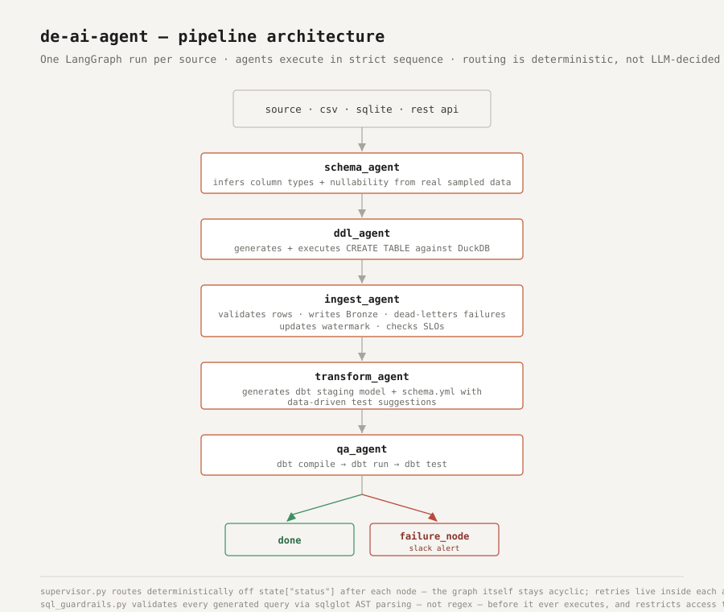

# de-ai-agent

Multi-agent data engineering pipeline that ingests FIFA World Cup 2026 data from 6 heterogeneous sources into Snowflake, transforms it with dbt, and validates it with data-driven quality tests — orchestrated by a LangGraph state machine.



## What this demonstrates

- **Multi-agent orchestration** (LangGraph): 5 agents (schema inference, DDL generation, ingestion, dbt transformation, QA) run as a deterministic state graph per source, with retry logic and error routing to a failure node.
- **Heterogeneous source ingestion**: CSV (static files), SQLite (local operational DB), and a live REST API — three real-world ingestion patterns in one pipeline.
- **Data-driven quality profiling**: a single-pass column profiler computes null rate, uniqueness, and value-range statistics directly from sampled data, and automatically generates the appropriate dbt tests (`not_null`, `unique`, `dbt_expectations` range checks) — not hardcoded per source.
- **Governance**: automatic PII detection (whole-word matching on column names), Snowflake query tagging for cost attribution, dead-letter routing for rows that fail validation, and SLO-based row-count/dead-letter-rate breach detection.
- **Real data only**: all 6 sources use real, verifiable data — historical match results (1872–present), World Cup 2026 fixtures and live scores, and full 2026 squad rosters — sourced from [openfootball](https://github.com/openfootball/worldcup.json) (public domain).

## Sources

| Source | Type | Rows | Notes |
|---|---|---|---|
| `historical_results` | CSV | 49,481 | International match results, 1872–present |
| `historical_goals` | CSV | 47,575 | Goalscorers linked to results |
| `historical_shootouts` | CSV | 680 | Penalty shootout outcomes |
| `worldcup_api` | REST API | 412 | Live WC 2026 fixtures/scores, 2 tables |
| `national_teams` | SQLite | 48 | Real WC 2026 qualified teams + groups |
| `player_profiles` | SQLite | 1,248 | Real WC 2026 full squad rosters |

## Stack

- **Orchestration**: LangGraph
- **Warehouse**: Snowflake
- **Transformation**: dbt (+ `dbt_expectations`, `dbt_date` packages)
- **Ingestion**: `snowflake-connector-python`, `httpx`, `sqlite3`
- **LLM**: local Ollama (`llama3.1:8b`) for schema review and dbt model generation, with deterministic fallback logic when unavailable

## Running it

```bash
python -m venv .venv && source .venv/bin/activate
pip install -r requirements.txt
cp .env.example .env   # fill in Snowflake credentials

python seed_fifa_db.py                              # seed local SQLite sources
python -m agents.supervisor --source historical_results  # run one source
python -m agents.supervisor                          # run all 6 sources
```

## Status

All 6 sources ingest, transform, and pass dbt tests end-to-end against Snowflake. Still in progress: Prefect scheduling, Bronze retention policy automation, role-to-access documentation, and a FastAPI/Streamlit presentation layer.
